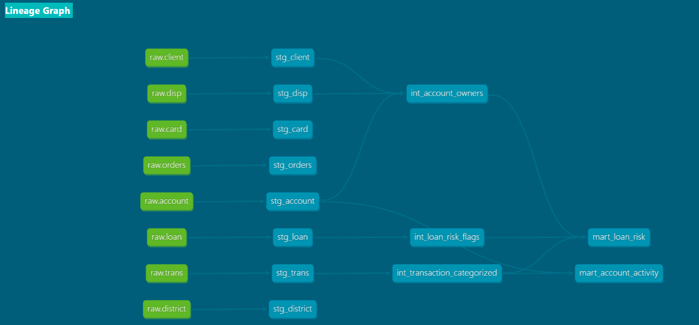

# speedrunning-dbt-snowflake

revisiing dbt and snowflake using Berka dataset
(czech bank dataset from the 90s, used in the PKDD'99 challenge). Raw csvs dumped into snowflake and then
dbt for all transformations. keeping it small.

## whats in the data

8 raw tables, all sitting in `raw.*` in snowflake:

| table    | rows (ish)  | what it is                                     |
|----------|-------------|--------------------------------------------------|
| account  | 4500        | bank accounts                                      |
| card     | 892         | credit cards, tied to a disposition                |
| client   | 5369        | people                                             |
| disp     | 5369        | (owner or disponent)                               |
| district | 77          | demographic/economic stuff per district            |
| loan     | 682         | loans                                              |
| orders   | 6471        | standing payment orders                            |
| trans    | ~1,056,320  | transactions                                       | 

data's from here: https://www.kaggle.com/datasets/marceloventura/the-berka-dataset

## folder structure

```
models/
  staging/       one model per raw table
  intermediate/  joins + business logic that needs more than one table
  marts/         resultant tables 
macros/
  generate_schema_name.sql   stops dbt from prefixing every schema with raw_
```

each layer gets its own schema in snowflake (staging / intermediate / marts) so
raw data and transformed data doesn't get mixed up in the same place.

## layer description

**staging** -- Cleanup - renaming cols, casting dates properly, and
decoding some czech strings in english (frequency codes, transaction type
codes etc). no joins here.

**intermediate** -- joins + interpretation.
- `int_account_owners` -- joins disp + client + account, filtered to just OWNER type
  (only owners can actually take loans or set up standing orders, disponents cant)
- `int_loan_risk_flags` -- turns the raw A/B/C/D loan status into is_defaulted /
  is_active flags
- `int_transaction_categorized` -- mostly passthrough from staging but adds a flag
  for loan repayment transactions so its not double counted later on

**marts** -- deliverables
- `mart_loan_risk` -- one row per loan. status, owner info, and a payment completion
  ratio (payments made vs expected) instead of raw payment count, since newer
  loans will have fewer payments and that shouldnt look like a red flag
- `mart_account_activity` -- account activity by month, credits/withdrawals/loan
  repayments, avg balance etc

## things to note 

- `birth_number` is different -- its supposed to be YYMMDD but for women they
  add 50 to the month. so month 62 = december (62-50) + tells you the
  client is female. one column encodes 2 facts.
- loan payments show up TWICE in this dataset. once as a row in `loan` and again as
  individual transactions in `trans` (k_symbol = UVER). when you sum transaction
  amounts without filtering this out you will double count loan cashflow.
- one district has a `'?'` string instead of real data for 1995
  (unemployment rate + crime count) bc it didnt exist as its own district yet that
  year. usage of to TRY_CAST instead of CAST.
- found a `VYBER` value in the `type` column when it should be in
  `operation` -- some rows are inconsistent, treated it as a withdrawal.
- loans that look "barely paid" (like only 1-2 payments) arent necessarily broken,
  sometimes they just started recently and haven't had time to build up payment
  history yet. this is why the mart uses a ratio instead of a raw count

## to run this :-

```bash
dbt debug             
dbt run               
dbt test              
dbt docs generate     
dbt docs serve        
```

## graph


